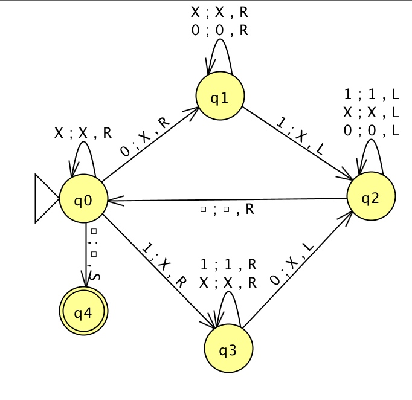

# Turing Machine

This repository contains a small deterministic turing machine library and simulator.
The simulator can be found in the folder `/TuringSimulator`. After being compiled, it can be called as follows:
```bash
$ cd ./TuringSimulator/bin/Debug

# on linux
$ sudo mono tmsim.exe <path_of_config_file>
# on windows
$ tmsim <path_of_config_file>
```
The configuration file must be an existing document with the following structure:
```antlr

document := initializations '\n' states '\n' transitions

initializations := initializations '\n' initialization
                 | initialization
                 | comment_line

// The charset defines the set of characters in the turing machine's alphabet. The characters
// are seperated by spaces. The instruction '%blank ...' sets the blank symbol and '%memory ...'
// the initial memory layout
initialization := '%charset ' charset
                | '%blank ' char
                | '%memory ' chars

states := states '\n' state_decl
        | state_decl
        | comment_line

// The prefix '>' denotes the initial state
// The optional suffix 'A' or 'B' denote whether the state halts and accepts or rejects
state_decl := '> ' num
            | num
            | num 'A'
            | num 'R'

transitions := transitions '\n' trans
             | trans
             | comment_line

// The transition  x c -> d a y  will be executed when any of the characters c was read in the
// state x. The character d will be written and the turing machine will move according to a and
// go into the state y.
trans := num ' ' chars ' -> ' char ' ' action ' ' num

// Turing machine actions like 'move left', 'move right', 'don't move'
action := 'L'
        | 'R'
        | '-'

charset := charset ' ' char
         | char

chars := chars char
       | char

// Characters can be everything except whitespace
char := [^\s]

// Comments must start at the beginning of a line
comment_line := '//' [^\n]*
```

-----

An example turing configuration for the following image could be:

```text
// turing configuration to accept any sequence of {1,0}* which is a palindrome

%charset _ x 0 1
%blank _
%memory 000101101000

> 0
1
2
3
4 A


0 0 -> x R 1
0 1 -> x R 3
0 x -> x R 0
0 _ -> _ - 4

1 0 -> 0 R 1
1 1 -> x L 2
1 x -> x R 1

2 0 -> 0 L 2
2 1 -> 1 L 2
2 x -> x L 2
2 _ -> _ R 0

1 0 -> x L 2
1 1 -> 1 R 1
1 x -> x R 1

```
